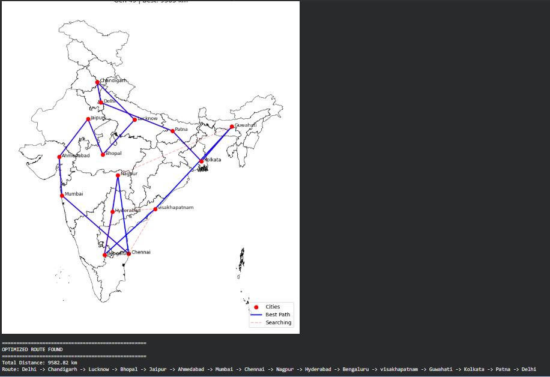

#**Travelling Salesman Problem with Indian cities using Genetic Algorithm**
# 🗺️ Travelling Salesman Problem - 15 Indian Cities



## 📌 Problem Statement
The **Travelling Salesman Problem (TSP)** is a classic optimization problem where the goal is to find the **shortest possible route** that visits a given set of cities **exactly once** and returns to the starting point.

This project solves TSP for **15 major Indian cities** using a **Genetic Algorithm (GA)**.

---

## 🏙️ Cities Covered
| # | City           |
|---|----------------|
| 1 | Delhi          |
| 2 | Chandigarh     |
| 3 | Lucknow        |
| 4 | Bhopal         |
| 5 | Jaipur         |
| 6 | Ahmedabad      |
| 7 | Mumbai         |
| 8 | Chennai        |
| 9 | Nagpur         |
| 10 | Hyderabad     |
| 11 | Bengaluru     |
| 12 | Visakhapatnam |
| 13 | Guwahati      |
| 14 | Kolkata       |
| 15 | Patna         |

---

## 🧬 Algorithm Used
**Genetic Algorithm (GA)**
- Mimics the process of natural evolution
- Uses **selection, crossover, and mutation** to evolve better routes over generations
- Finds a near-optimal solution efficiently

---

## 📊 Result
> ✅ **Optimized Route Found!**

**Total Distance:** `9582.82 km`

**Best Route:**
```
Delhi → Chandigarh → Lucknow → Bhopal → Jaipur → Ahmedabad → Mumbai
→ Chennai → Nagpur → Hyderabad → Bengaluru → Visakhapatnam
→ Guwahati → Kolkata → Patna → Delhi
```

---

## 📁 Project Files
| File | Description |
|------|-------------|
| `Travelling_salesman_15cities.ipynb` | Main Jupyter Notebook with full code |
| `India.geojson` | GeoJSON map data for India |
| `route_output.png` | Output image showing the optimized route |

---

## 🛠️ Technologies Used
- **Python 3**
- **Jupyter Notebook**
- **Matplotlib** – plotting the route on India map
- **GeoPandas** – reading India.geojson map data
- **Pandas** – data handling
- **ipywidgets** – interactive widgets for visualization

---

## ▶️ How to Run
1. Clone this repository:
```bash
   git clone https://github.com/Madii-hoc/Travelling-Salesman-15Cities.git
```
2. Open the notebook:
```bash
   jupyter notebook Travelling_salesman_15cities.ipynb
```
3. Run all cells to see the optimized route!

---

## 📷 Output
The blue lines show the **best path** found by the Genetic Algorithm.
The pink dashed lines show the **search paths** explored during optimization.

---

## 👤 Author
**BATTA MADHAV SAIRAM**
- GitHub: [@Madii-hoc](https://github.com/yourusername)

---

## 📄 License
This project is open source and available under the [MIT License](LICENSE).
